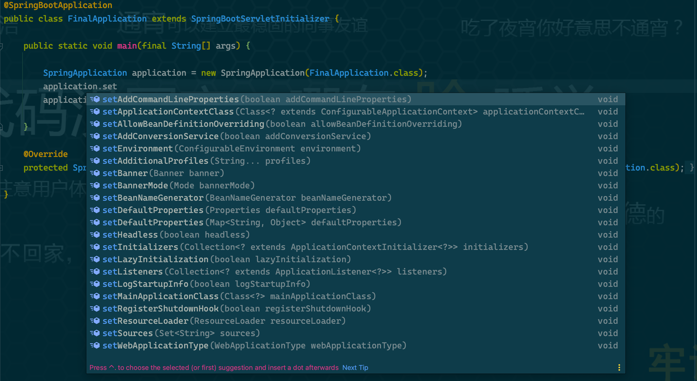

# Spring Application 启动流程

## 简介

**`SpringApplication`是 *Spring Boot* 提供的，可从 Java `main` 方法*引导和启动* `Spring` 应用程序的类。**

本文将以`SpringApplication`的使用方法`run(Class)`为切入点，通过分析构造方法和`run`方法的源码，了解`SpringApplication`应用的基本启动流程。

## 用法

### 常规用法

在大多数情况下，可以直接从`main`方法中调用静态`run(Class, String[])`方法来引导应用程序：

```java
package org.ifinal.finalframework.example;

@SpringBootApplication
public class FinalApplication {

    public static void main(final String[] args) {
        SpringApplication.run(FinalApplication.class);
    }

}
```

> 像在文章[你好，世界](../quick-start/hello-world.md)中的`SpringApplication.run(FinalApplication.class)`那样。

### 定制用法

对于更高级的配置，可以在运行之前创建和定制`SpringApplication`实例：

```java
public static void main(String[]args){
    SpringApplication application=new SpringApplication(MyApplication.class);
// ... customize application settings here
    application.run(args)
    }
```

通过IDE的代码提示功能，发现如下图的选项：




#### 注册监听

通过`addListeners`或`setListeners`方法，可以向应用中注册监听器(`ApplicationListener`)。

```java
application.addListeners(new ApplicationReadyEventListener());
```

## 默认实现

### 引导步骤

默认情况下，`SpringApplication`将执行以下步骤来引导您的应用程序：

* 创建一个适当的`ApplicationContext`实例（取决于您的类路径）。
* 注册一个`CommandLinePropertySource`以将命令行参数注入到为`Spring`属性中。
* 刷新应用程序上下文，加载所有单例 Bean。
* 触发任何`CommandLineRunner` Bean

### 加载Bean

加载并读取不同来源下的bean：

* 由 `AnnotatedBeanDefinitionReader` 加载的**应用完全限定的类名**所在包下的Bean。
* 由 `XmlBeanDefinitionReader`加载的声明在`XML`文件中的Bean。
* 由 `GroovyBeanDefinitionReader`加载的`groovy`脚本声明的Bean。
* 由 `ClassPathBeanDefinitionScanner` 扫描 `<context:component-scan>` 节点所指定的软件包中的Bean。

> 一般情况下，启动类所在的包应包含所有子模块的包，这样才能确保`SpringApplication`可以读取并加载到项目中声明的Bean。

## 源码分析

既然是从`SpringApplication.run(Class)`开始的，那就看看它都做了些什么吧：

* `SpringApplicatin.run(Class)`

```java
package org.springframework.boot;

public class SpringApplication {

    public static ConfigurableApplicationContext run(Class<?> primarySource, String... args) {
        return run(new Class<?>[]{primarySource}, args);
    }

    public static ConfigurableApplicationContext run(Class<?>[] primarySources, String[] args) {
        return new SpringApplication(primarySources).run(args);
    }

}
```

可以看到先是通过构造方法`new SpringApplication(primarySources)`创建了一个`SpringApplication`的实例，然后调用`run`方法，继续跟进构造函数。

### 构造方法

```java
package org.springframework.boot;

public class SpringApplication {

    public SpringApplication(Class<?>... primarySources) {
        this(null, primarySources);
    }

    public SpringApplication(ResourceLoader resourceLoader, Class<?>... primarySources) {
        this.resourceLoader = resourceLoader;
        Assert.notNull(primarySources, "PrimarySources must not be null");
        // 保存配置源
        this.primarySources = new LinkedHashSet<>(Arrays.asList(primarySources));
        // 初始化 WEB 应用类型
        this.webApplicationType = WebApplicationType.deduceFromClasspath();
        // 加载 spring.factories 文件中的 ApplicationContextInitializer
        setInitializers((Collection) getSpringFactoriesInstances(ApplicationContextInitializer.class));
        // 加载 spring.factories 文件中的 ApplicationListener
        setListeners((Collection) getSpringFactoriesInstances(ApplicationListener.class));
        // 推断主应用类，这里是 FinalApplication，即参数类
        this.mainApplicationClass = deduceMainApplicationClass();
    }

}
```

第15行代码的字面意思是从`classpath`推断`WebApplicationType`，跟进`deduceFromClasspath()`方法，发现Spring是通过判断特定的类是否存在来决定`WebApplicationType`的。

第17、19两行代码中，发现都调用了`getSpringFactoriesInstances`方法，跟进发现一个关键的一行代码`SpringFactoriesLoader.loadFactoryNames(type,classLoader)`，
该方法功能类似于JDK的SPI，用于加载Spring SPI的类名：

```java
package org.springframework.boot;

public class SpringApplication {

    private <T> Collection<T> getSpringFactoriesInstances(Class<T> type) {
        return getSpringFactoriesInstances(type, new Class<?>[]{});
    }

    private <T> Collection<T> getSpringFactoriesInstances(Class<T> type, Class<?>[] parameterTypes, Object... args) {
        ClassLoader classLoader = getClassLoader();
        // Use names and ensure unique to protect against duplicates
        Set<String> names = new LinkedHashSet<>(SpringFactoriesLoader.loadFactoryNames(type, classLoader));
        List<T> instances = createSpringFactoriesInstances(type, parameterTypes, classLoader, args, names);
        AnnotationAwareOrderComparator.sort(instances);
        return instances;
    }

}
```

> `SpringFactoriesLoader`是Spring SPI的加载器，用于从`META-INF/spring.factories` 配置文件中加载指定的SPI。

第21行`deduceMainApplicationClass()`方法通过分析堆栈信息`StackTraceElement`来推导主应用`Class`，代码如下：

```java
package org.springframework.boot;

public class SpringApplication {

    private Class<?> deduceMainApplicationClass() {
        try {
            StackTraceElement[] stackTrace = new RuntimeException().getStackTrace();
            for (StackTraceElement stackTraceElement : stackTrace) {
                if ("main".equals(stackTraceElement.getMethodName())) {
                    return Class.forName(stackTraceElement.getClassName());
                }
            }
        } catch (ClassNotFoundException ex) {
            // Swallow and continue
        }
        return null;
    }

}
```

至此，构造方法分析结束，收获收下几点：

* Spring 是通过分析`classpath`下特定的`Class`是否存在来决定`WebApplicationType`的；
* Spring 通过`SpringFactoriesLoader`加载了`ApplicationContextInitializer`,`ApplicationListener`扩展；
* Spring 通过分析堆栈信息`StackTraceElement`来推导主应用`Class`。

* 再来分析`run(String[])`方法

### run方法

```java
package org.springframework.boot;

public class SpringApplication {

    public ConfigurableApplicationContext run(String... args) {
        // 开始停止监听
        StopWatch stopWatch = new StopWatch();
        stopWatch.start();

        ConfigurableApplicationContext context = null;
        // 异常报告收集 
        Collection<SpringBootExceptionReporter> exceptionReporters = new ArrayList<>();
        configureHeadlessProperty();

        // 开启事件监听
        SpringApplicationRunListeners listeners = getRunListeners(args);
        listeners.starting();
        try {
            // 解析启动参数
            ApplicationArguments applicationArguments = new DefaultApplicationArguments(args);
            // 准备 ConfigurableEnvironment
            ConfigurableEnvironment environment = prepareEnvironment(listeners, applicationArguments);
            configureIgnoreBeanInfo(environment);
            // 打印 Banner
            Banner printedBanner = printBanner(environment);
            // 创建 ApplicationContext
            context = createApplicationContext();
            exceptionReporters = getSpringFactoriesInstances(SpringBootExceptionReporter.class,
                new Class[]{ConfigurableApplicationContext.class}, context);
            // 准备 ApplicationContext
            prepareContext(context, environment, listeners, applicationArguments, printedBanner);
            // 刷新 ApplicationContext
            refreshContext(context);
            // 后置刷新回调，用于子类扩展
            afterRefresh(context, applicationArguments);
            stopWatch.stop();
            if (this.logStartupInfo) {
                new StartupInfoLogger(this.mainApplicationClass).logStarted(getApplicationLog(), stopWatch);
            }
            listeners.started(context);
            callRunners(context, applicationArguments);
        } catch (Throwable ex) {
            handleRunFailure(context, ex, exceptionReporters, listeners);
            throw new IllegalStateException(ex);
        }

        try {
            listeners.running(context);
        } catch (Throwable ex) {
            handleRunFailure(context, ex, exceptionReporters, null);
            throw new IllegalStateException(ex);
        }
        return context;
    }

}
```

第16行`getFunListeners(args)`通过`SpringFactoriesLoader`加载了扩展`SpringApplicationRunListener`并实例了`SpringApplicationRunListeners`对象。

> `SpringApplicationRunListeners`是`SpringApplicationRunListener`的集合表现形式，用于触发所有`SpringApplicationRunListener`实例。

第17行调用了`SpringApplicationRunListeners`的`starting()`方法。

第20行创建了一个`ApplicationArguments`的实例。

第22行创建了一个`ConfigurableEnvironment`的实例，并在方法内调用了`SpringApplicationRunListeners`的`environmentPrepared(environment)`方法。

第27行创建了一个`ConfigurableApplicationContext`的实例。

第28行通过`SpringFactoriesLoader`加载了扩展`SpringBootExceptionReporter`。

第31行`prepareContext`方法用于准备`ConfigurableApplicationContext`，稍后单独分析，现在直接跳过进行下一行。

第33行` refreshContext(context)`最终调用了`ConfigurableApplicationContext`的`refreah()`方法。

第34行`afterRefresh(context, applicationArguments)`是一个空的方法，用于子类扩展。

第40行调用了`SpringApplicationRunListeners`的`started(context)`方法。

第41行通过`callRunners()`调用了所有`ApplicationRunner`和`CommandLineRunner`实例的`run`方法。

第43行当有异常时，调用了`SpringApplicationRunListeners`的`failed(context, exception)`方法。

第48行调用了`SpringApplicationRunListeners`的`running(context)`方法。

现在，回过头来分析`prepareContext`方法

### prepareContext

```java
package org.springframework.boot;

public class SpringApplication {

    private void prepareContext(ConfigurableApplicationContext context, ConfigurableEnvironment environment,
        SpringApplicationRunListeners listeners, ApplicationArguments applicationArguments, Banner printedBanner) {
        context.setEnvironment(environment);
        postProcessApplicationContext(context);
        applyInitializers(context);
        listeners.contextPrepared(context);
        if (this.logStartupInfo) {
            logStartupInfo(context.getParent() == null);
            logStartupProfileInfo(context);
        }
        // Add boot specific singleton beans
        ConfigurableListableBeanFactory beanFactory = context.getBeanFactory();
        beanFactory.registerSingleton("springApplicationArguments", applicationArguments);
        if (printedBanner != null) {
            beanFactory.registerSingleton("springBootBanner", printedBanner);
        }
        if (beanFactory instanceof DefaultListableBeanFactory) {
            ((DefaultListableBeanFactory) beanFactory)
                .setAllowBeanDefinitionOverriding(this.allowBeanDefinitionOverriding);
        }
        if (this.lazyInitialization) {
            context.addBeanFactoryPostProcessor(new LazyInitializationBeanFactoryPostProcessor());
        }
        // Load the sources
        Set<Object> sources = getAllSources();
        Assert.notEmpty(sources, "Sources must not be empty");
        load(context, sources.toArray(new Object[0]));
        listeners.contextLoaded(context);
    }

}
```

第9行调用了`ApplicationContextInitializer`的`initialize(context)`。

第10行调用了`SpringApplicationRunListeners`的`contextPrepared(context)`方法。

第31行内部创建了一个`BeanDefinitionLoader`实例并调用了`load()`方法。

> `BeanDefinitionLoader`用于加载`BeanDefinition`，包含以下读取器：
> * 由 `AnnotatedBeanDefinitionReader` 加载的**应用完全限定的类名**所在包下的Bean。
> * 由 `XmlBeanDefinitionReader`加载的声明在`XML`文件中的Bean。
> * 由 `GroovyBeanDefinitionReader`加载的`groovy`脚本声明的Bean。
> * 由 `ClassPathBeanDefinitionScanner` 扫描 `<context:component-scan>` 节点所指定的软件包中的Bean。

第32行调用了`SpringApplicationRunListeners`的`contextLoaded(context)`方法。

至此，SpringApplication 的核心启动流程就完成了。

## 小结

本节以`SpringApplication.run(Class)`方法为切入点，通过分析构造方法和`run`方法等源码，获取了以下知识点：

* 通过`SpringFactoriesLoader`加载了以下扩展点（SPI）：
  * ApplicationContextInitializer
  * ApplicationListener
  * SpringApplicationRunListener
  * SpringBootExceptionReporter
* 通过SpringApplicationRunListeners触发了SpringApplicationRunListener的一系列方法。
* 在`refreshContext(context)`刷新环节中，指向了`ConfigurableApplicationContext`接口的`refresh`方法。

本文结束。