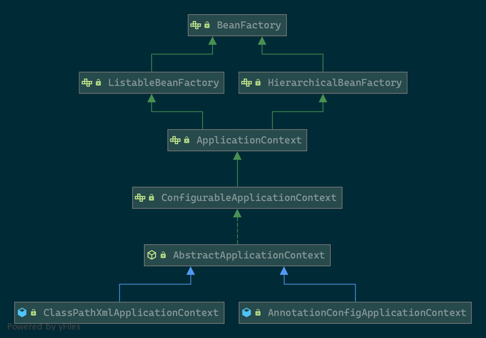

# ApplicationContext

## 简介

**应用程序（`ApplicationContext`）配置接口，是 Spring Ioc 的核心。**

*提供了以下功能：*

* 从`ListableBeanFactory`继承用于访问应用程序组件的Bean工厂方法。
* 继承自`ResourceLoader`接口以通用方式加载文件资源的能力。
* 继承自`ApplicationEventPublisher`接口将事件发布给注册的侦听器的能力。
* 继承自`MessageSource`接口解决消息，支持国际化的能力。

## 继承关系

```mermaid
classDiagram
    BeanFactory <|-- ListableBeanFactory
    BeanFactory <|-- HierarchicalBeanFactory
    ListableBeanFactory <|-- ApplicationContext
    HierarchicalBeanFactory <|-- ApplicationContext
    ApplicationContext <|-- ConfigurableApplicationContext
    ConfigurableApplicationContext <|-- AbstractApplicationContext
    AbstractApplicationContext <|-- AnnotationConfigApplicationContext
    AbstractApplicationContext <|-- ClassPathXmlApplicationContext
```



## 源码分析

在[Spring Application 启动流程](../boot/spring-application.md)一文中，已知`SpringApplication`是根据`classpath`下的类加载以下实现类之一：

* AnnotationConfigServletWebServerApplicationContext
* AnnotationConfigReactiveWebServerApplicationContext
* AnnotationConfigApplicationContext

为简化分析的复杂度，本文以默认的`DEFAULT_CONTEXT_CLASS`，即`AnnotationConfigApplicationContext`为例分析。

### AnnotationConfigApplicationContext

通过查看`AnnotationConfigApplicationContext`的源码，发现其有以下几点：

* 实例化一个`AnnotatedBeanDefinitionReader`

```java
this.reader=new AnnotatedBeanDefinitionReader(this);
```

* 实例化一个`ClassPathBeanDefinitionScanner`

```java
this.scanner=new ClassPathBeanDefinitionScanner(this);
```

* 注册组件类`register(componentClasses)`或扫描包`scan(basePackages)`

* 调用`refresh()`方法。

**上述流程图如下：**

```mermaid
flowchart TD
    subgraph one["AnnotationConfigApplicationContext"]
    a1["this.reader = new AnnotatedBeanDefinitionReader(this)"]-->a2["this.scanner = new ClassPathBeanDefinitionScanner(this)"]
    a2-->a31["register(componentClasses)"]
    a2-->a32["scan(basePackages)"]
    a31-->a4["refresh()"]
    a32-->a4
    end
```

**核心源码如下：**

```java
package org.springframework.context.annotation;

public class AnnotationConfigApplicationContext extends GenericApplicationContext implements AnnotationConfigRegistry {

    private final AnnotatedBeanDefinitionReader reader;

    private final ClassPathBeanDefinitionScanner scanner;

    public AnnotationConfigApplicationContext() {
        this.reader = new AnnotatedBeanDefinitionReader(this);
        this.scanner = new ClassPathBeanDefinitionScanner(this);
    }

    public AnnotationConfigApplicationContext(DefaultListableBeanFactory beanFactory) {
        super(beanFactory);
        this.reader = new AnnotatedBeanDefinitionReader(this);
        this.scanner = new ClassPathBeanDefinitionScanner(this);
    }

    public AnnotationConfigApplicationContext(Class<?>... componentClasses) {
        this();
        register(componentClasses);
        refresh();
    }

    public AnnotationConfigApplicationContext(String... basePackages) {
        this();
        scan(basePackages);
        refresh();
    }

}
```

### AnnotatedBeanDefinitionReader

`AnnotatedBeanDefinitionReader`通过`AnnotationConfigUtils.registerAnnotationConfigProcessors(this.registry)`向容器内注册了几个**创世纪**的类：

* ConfigurationClassPostProcessor
* AutowiredAnnotationBeanPostProcessor
* CommonAnnotationBeanPostProcessor
* EventListenerMethodProcessor
* DefaultEventListenerFactory

### refresh

#### 关系

`refresh`方法由`ConfigurableApplicationContext`接口定义，并由`AbstractApplicationContext`提供核心实现，关系如下图所示：

```mermaid
classDiagram
    ConfigurableApplicationContext <|-- AbstractApplicationContext
    
    class ConfigurableApplicationContext {
        + refresh()
    }
```

#### 流程

`refresh()`的源码结构非常清晰，为一系列的方法调用（此处就不贴源码了），调用流程如下：

```mermaid
flowchart TD
    subgraph two["refresh()"]
    b1["prepareRefresh()"]-->b2["beanFactory = obtainFreshBeanFactory()"]
    b2-->b3["prepareBeanFactory(beanFactory)"]
    b3-->b4["postProcessBeanFactory(beanFactory)"]
    b4-->b5["invokeBeanFactoryPostProcessors(beanFactory)"]
    b5-->b6["registerBeanPostProcessors(beanFactory)"]
    b6-->b7["initMessageSource()"]
    b7-->b8["initApplicationEventMulticaster()"]
    b8-->b9["onRefresh()"]
    b9-->b10["registerListeners()"]
    b10-->b11["finishBeanFactoryInitialization(beanFactory)"]
    b11-->b12["finishRefresh()"]
    b12-->b13["resetCommonCaches()"]
    end
```

除了方法调用清晰之外，基被调用的方法功能也相对简单，以一个表格简单说明：

| 方法                                           | 作用                                          | 备注                |
| ---------------------------------------------- | --------------------------------------------- | ------------------- |
| `prepareRefresh()`                             | 初始化`PropertySources`,准备环境等            |                     |
| `obtainFreshBeanFactory()`                     | 获取`ConfigurableListableBeanFactory`         |                     |
| `prepareBeanFactory(beanFactory)`              | 准备`ConfigurableListableBeanFactory`         |                     |
| `postProcessBeanFactory(beanFactory)`          | 空方法                                        |                     |
| `invokeBeanFactoryPostProcessors(beanFactory)` | 触发后置处理器`BeanFactoryPostProcessor`      | 组件类的扫描、AOP等 |
| `registerBeanPostProcessors(beanFactory)`      | 实例、排序并注册后置处理器`BeanPostProcessor` |                     |
| `initMessageSource()`                          | 初始化`MessageSource`                         |                     |
| `initApplicationEventMulticaster()`            | 初始化`ApplicationEventMulticaster`           |                     |
| `onRefresh()`                                  | 空方法                                        |                     |
| `registerListeners()`                          | 实例并注册`ApplicationListener`               |                     |
| `finishBeanFactoryInitialization(beanFactory)` | 实体化所有非懒加载的单例对象                  |                     |
| `finishRefresh()`                              | 完成刷新，发布事件`ContextRefreshedEvent`     |                     |
| `destroyBeans()`                               | 当发生异常时，销毁已经实例化的对象            |                     |
| `resetCommonCaches()`                          | 清理缓存                                      |                     |
|                                                |                                               |                     |

## 小结

本文以`AnnotationConfigApplicationContext`为例，简述了Spring容器初始化的流程，说明了核心方法`refresh`中各个被调用方法的主要功能。